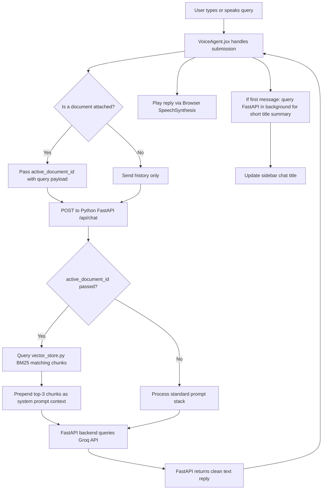

# Python Developer's Guide to the React Frontend

As an AI Engineer with a Python background, this guide is designed to map React and JavaScript concepts in this project to their closest Python equivalents, helping you understand and modify the frontend code easily.

---

## 1. Concept Translation Map

| React / JavaScript Concept | Python Equivalent / Analogy | Explanation |
| :--- | :--- | :--- |
| **`useState(initial)`** | Class Instance Variables (State) | Tracks data that causes the UI to re-render when changed. In Python, this is like updating a class field (e.g. `self.user_name = "Sanjay"`) that triggers a screen redraw in Gradio/Streamlit. |
| **`useEffect(func, deps)`** | Observers / Setter Hooks | Runs code when specific variables (`deps`) change. In Python, this is like setting a `@property` setter that executes a callback when a value is mutated. |
| **JSX (`<div className="foo">...</div>`)** | Template Engines (Jinja2 / Gradio) | Embeds HTML structure directly in the code. In Python, this is like returning HTML strings in Flask or returning nested layouts in Streamlit/Reflex. |
| **`Array.map()`** | List Comprehensions | Loops over a list to generate items (e.g., listing chats in a sidebar). In Python: `[ItemComponent(x) for x in chats]`. |
| **`import / export`** | `import / from ... import ...` | Standard module importing. JavaScript modules must explicitly `export default` a function to make it importable. |
| **Async/Await (`async () => {}`)** | Python Asyncio (`async def`) | Asynchronous non-blocking network calls (like querying the FastAPI backend). |

---

## 2. Key React Hooks Decoded (in Python Terms)

### A. State Management: `useState`
In JavaScript:
```javascript
const [userName, setUserName] = useState("Sophia");
```
* **Python Analogy**:
  ```python
  class VoiceAgentComponent:
      def __init__(self):
          self._user_name = "Sophia"  # userName state
          
      def set_user_name(self, name: str):  # setUserName setter
          self._user_name = name
          self.trigger_ui_redraw() # React handles this redraw automatically!
  ```

### B. Reactive Side Effects: `useEffect`
In JavaScript:
```javascript
useEffect(() => {
  localStorage.setItem('voice_agent_user_name', userName);
}, [userName]);
```
* **Python Analogy**:
  ```python
  # Triggers whenever user_name is modified
  @observe("user_name")
  def on_user_name_change(new_name):
      local_storage.set('voice_agent_user_name', new_name)
  ```

---

## 3. Core React Components Breakdown

All frontend components are located in `frontend/src/components/`.

### 1. [VoiceAgent.jsx](file:///c:/voice%20agent/frontend/src/components/VoiceAgent.jsx) (The Main Orchestrator)
This is equivalent to a **main controller class** in Python. It maintains the core states and orchestrates:
- **`chats`**: A list of chat session dictionaries (e.g. `[{ "id": "1", "title": "Math help", "messages": [] }]`).
- **`documents`**: A list of uploaded text/PDF document content parsed in-browser using Mozilla PDF.js.
- **`handleUserUtterance`**: The core controller loop that sends the user's chat input to the FastAPI Python backend and plays the reply via speech synthesis.

### 2. [ChatHistory.jsx](file:///c:/voice%20agent/frontend/src/components/ChatHistory.jsx) (Message Bubble Feed)
Think of this as a **rendering template**.
- If the chat has no messages, it renders the welcome screen with the dynamic greeting (`Hello {userName},`) and four prompt cards.
- If messages exist, it loops over them (using `messages.map(...)`) and returns styled bubble list items.
- If the assistant is loading a response (`isProcessing` is true), it renders a bouncing three-dot loader.

### 3. [MicButton.jsx](file:///c:/voice%20agent/frontend/src/components/MicButton.jsx) (Microphone Trigger)
A button that changes its colors and icons reactively:
- Displays a square stop icon when listening (`isListening`).
- Displays a spinning loader when querying the API (`isProcessing`).
- Displays a speaker icon when speaking (`isSpeaking`).
- Explicitly uses `type="button"` to prevent triggering form submissions on Enter.

---

## 4. Semantic Search (RAG) Architecture

Instead of sending full text files to the LLM (which is slow and runs into token limits), this project implements a context-aware **Retrieval-Augmented Generation (RAG)** pipeline:
1. **Document Indexing (`POST /api/documents`)**:
   - When a document is uploaded, [VoiceAgent.jsx](file:///c:/voice%20agent/frontend/src/components/VoiceAgent.jsx) sends the content to the backend.
   - The backend splits the document into overlapping paragraphs (~800 characters each).
   - These chunks are saved locally in [document_store.json](file:///c:/voice%20agent/backend/chroma_db/document_store.json).
2. **Context Querying (`POST /api/chat`)**:
   - If a document is active during chat, the frontend sends its ID (`active_document_id`) along with the messages.
   - The backend retrieves the document's chunks and fits them into our local **BM25 Search Retriever** ([vector_store.py](file:///c:/voice%20agent/backend/app/services/vector_store.py)).
   - It matches the user's latest question against the document's chunks using term-relevance scoring.
   - It extracts the **top-3 most relevant paragraphs** and prepends them to the LLM system prompt context, ensuring extremely fast and accurate answers.

---

## 5. How Data Flows in the App



This modular architecture isolates the search indexer and query ranking logic entirely into Python (in your `backend/app/services/vector_store.py`), allowing you to tweak the text tokenizers or ranking parameters easily without modifying React!
